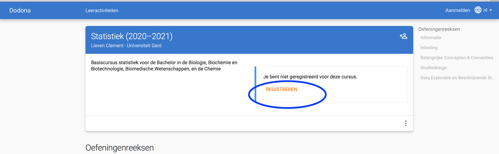

```{r setup, include=FALSE}
knitr::opts_chunk$set(echo = FALSE)
```

## BELANGRIJK

- Het cursusmateriaal zal worden verstrekt via Dodona.

- Klik niet op de cursuslinks naar de Dodona omgeving als je dit document bekijkt vanuit de Ufora omgeving.

- Voor Dodona is dit geen probleem, maar het centrale authenticatiesysteem van de UGent laat niet toe dat het binnen een andere website wordt geopend (om veiligheidsredenen).

- Kopiëer dus de Dodona cursuslinks en plak deze in een nieuwe browsertab om succesvol in te kunnen loggen op Dodona.

- Vergeet niet te registreren voor een cursus:
{width=70%}


## Cursus Statistiek

- Bachelor in de Biochemie en Biotechnologie: Statistiek (C000340)
- Bachelor in de Biologie: Statistiek (C000337)
- Bachelor in de Biomedische wetenschappen: Inleiding tot de Biostatistiek (
D012699 en D013106)
- Bachelor in de Chemie: Statistiek (C000337)

- Online leerpaden die zelfstandig worden gevolgd
- On campus booster sessie en responsiecolleges
- On campus werkcolleges


## Hoorcollege

[https://dodona.ugent.be/nl/courses/469/](https://dodona.ugent.be/nl/courses/469/)

- Doelstelling: Statistische geletterdheid

- Online Cursus

    - Kennis Clips
    - Volledige lesvrij op tijdstippen waarop hoorcollege is ingeroosterd
    - Bekijken van kennisclips $\pm$ tijd hoorcollege
    - Wanneer meer tijd wordt gespendeerd $\rightarrow$ verwerken 
    - Wekelijkse deadlines: op maandagavond om 23 uur
    - behalve H6: lineaire regressie (woensdag 3/11) en H10: Algemeen lineair model deel 1 (woensdag 1/12)
    - Wordt opgevolgt via Dodona
    - Registreren is verplicht

- On campus boostersessies en responsie colleges
    
    - H1-H9: Donderdag 14/10, 28/10, 4/11, 18/11, 25/11, 9/12, 16/12 8u30 - 10: Sterre S2 auditorium 1
    - H10: enkel BCBT en BIOMED op Dinsdag 14/12 8u30-10u (UZ AUD E)
    - Tweede verwerking
    - Belangrijk dat alle lesmateriaal van hoofdstuk reeds is doorgenomen (deadlines vallen voordien)
    - Groot leereffect 

- Alle deadlines en boostersessie in agenda Ufora


## On campus werkcolleges
  - Doelstelling: inzicht in statistiek door zelf data analyses uit te voeren
  - Introductie tot statistisch software pakket R
  - Week 1-4 Statistiek: Introductie tot R
      - [https://dodona.ugent.be/nl/courses/804/](https://dodona.ugent.be/nl/courses/804/)
  - Week 5-12 Statistiek: 
      - [https://dodona.ugent.be/nl/courses/469/](https://dodona.ugent.be/nl/courses/469/)

  - Registreren voor e-courses is verplicht
  - Week 1-12 On campus werkcollege in Dodona (niet-verplicht)
  - Wekelijkse deadlines (tellen mee voor permanente vorming)

## Contact en Opvolging

  - Lieven Clement (email: lieven.clement@ugent.be)
  - Assistent Biochemie en Biotechnologie: Jeroen Gilis email: Jeroen.Gilis@UGent.be) en Viktor Verstraelen(email: Viktor Verstraelen viktor.verstraelen@ugent.be) 
  - Assistent Biologie en Chemie: Hans Van Eetvelde (email: Hans.VanEetvelde@UGent.be)
  - Assistent Biomedische Elke Debrie (email: Elke.Debrie@UGent.be)


## Contact en Opvolging

  - Boostersessies en responsiecolleges:
      - Campus De Sterre S2 auditorium 1
      - 

## Examen

  - Permanente evaluatie: 5 studiepunten
      - 1 SP behalen deadlines hoorcolleges: score percentage op tijd ingediend
      - 1 SP deadlines werkcolleges: score percentage op tijd ingediend
      - 3 SP projecten (week 5-12) evalueren van vertrouwdheid met R. Score code + multiple choice om te pijlen naar inzicht

## Examen

  - Openboek examen: 15 studiepunten
      - Test op inzicht en logisch redeneren
      - Kritische analyse van de statistische output en resultaten in een wetenschappelijke publicatie
      - Grotere klemtoon op interpretatie dan berekening
      - Oefeningen
      - Multiple choice
      - Verhoogde cesuur
      
- Studenten die slaagden voor de niet-periode gebonden evaluatie kunnen hun score overdragen naar dit jaar. Dat kan via enquete op Ufora tot 08/10/2021. 

- Bij inhaalexamen examen onder een andere vorm

## Feedback

  - Enkel na inschrijving
  - Precieze datum wordt nog meegegeven
